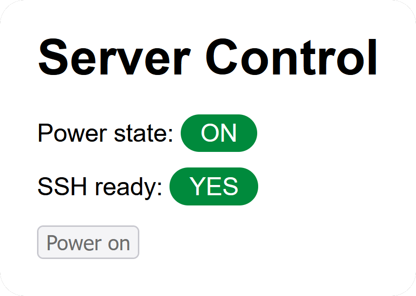

# wakeonweb

Runs a web server on a NodeMCU or similar to remote control a PC's power button. The microcontroller triggers the power button using a transistor, measures the power state by connecting to the `PWR LED` and provides an endpoint for the controlled device to signal SSH availability. You can configure credentials to limit access to the web page and the SSH notification endpoint.

## Connecting to the motherboard

The schematic used to wire up the NodeMCU to the motherboard can be found [here](../main/schematic.pdf). Note that some motherboards might work differently regarding internal pull-up/downs and voltages, so do some tests and measurements before using this circuit or designing your own version!

## Notifying the server once SSH is ready

1. Create the notification service file with something like nano: `sudo nano /etc/systemd/system/sshnotify.service`
2. Copy the contents of [sshnotify.service](../main/sshnotify.service) to it
3. If you configured credentials for the notification service (`SSH_USER` and `SSH_PASS`), use the line with `curl --user username:password` and replace `username` and `password` with those credentials
4. Replace the example IP with the local IP or hostname of your microcontroller running the web server
5. Enable the service with `sudo systemctl enable sshnotify`
